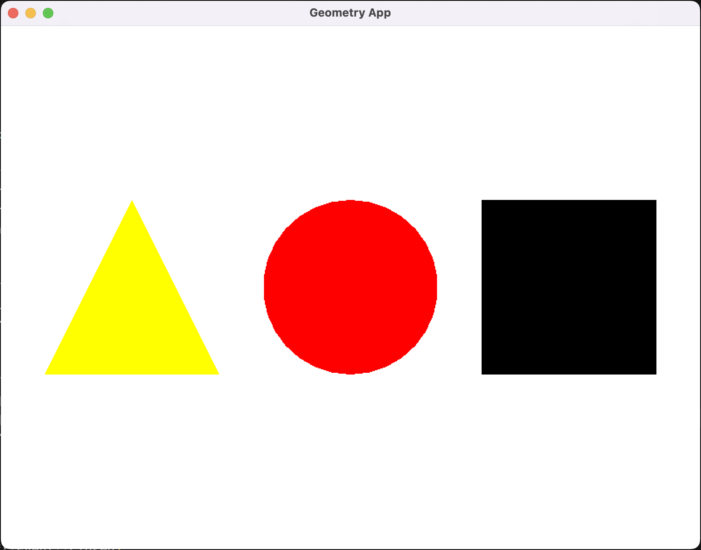

# Geometry
This is a pet project. C++ library for drawing geometric figures. SFML and OOP.

### MacOS
`brew install cmake`  
`brew install sfml@2`

### How to run a project
```
mkdir build
cd build
cmake ..
make
./GeometryApp
```
### Finally you'll see a pop-up window

